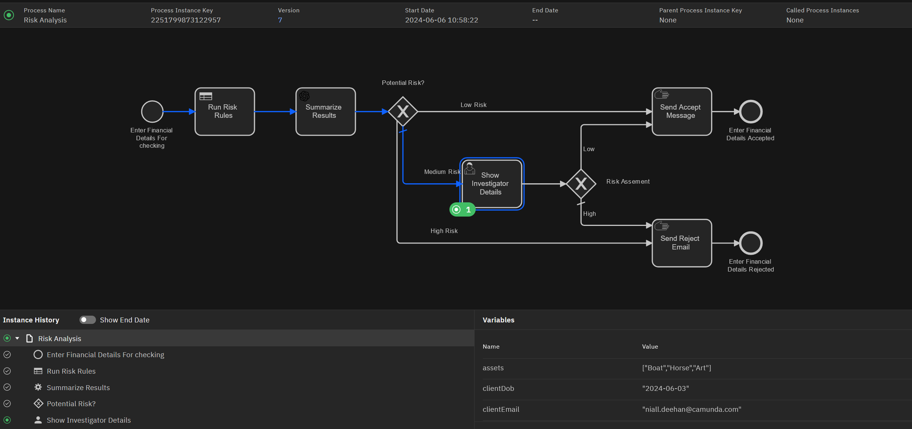
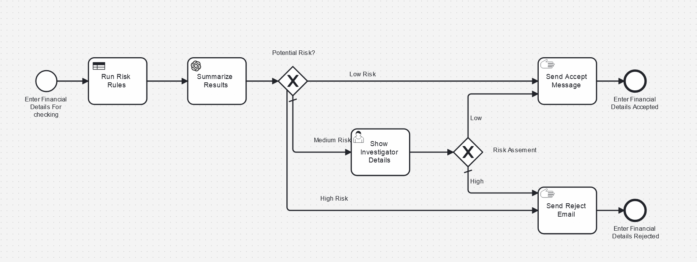
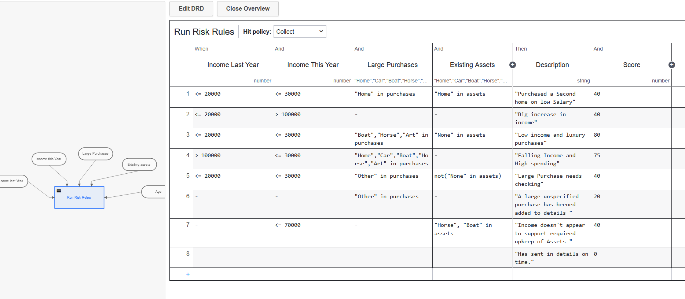

# Risk Analysis using DMN, OpenAI & Camunda

This is an example showcasing how a risk analysis process can utilize business rules and AI to help determine potential fraud or risk of an investment



## How it works

In this process a user enters some details of the their finances through a simple front end in order to be accepted for some financial plan or insurance. This triggers the a BPMN process to start where a Decision table will determine the how risky this person is as an investment. 

The result of the table gives a score and a list of descriptions of red flags. Then the process connects with OpenAI to summarize these descriptions and generate some suggested actions for further investigation. 

Finally - if the score from the risk analysis table was low enough, they're automatically accepted. If they they're too hight, automatically rejects and if it falls in the middle a user is tasked with looking at the financial details and the OpenAI summary and deciding on if they should be accepted or not.  

#### BPMN Model

This process model takes some financial details from someone and checks if they're low risk, high risk or in need of further investigation. 

It does this by taking in the data from a form and putting it through a DMN table. This table produces a score and a description of some potential red flags. Then we take those descriptions and feed them into ChatGPT via the OpenAI Connector and as for them to be summarized and how a further investigation should look. 

We then use the score from the DMN table as a condition on an XOR gateway in order to route the process to automatically accept `riskRating <= 40`, automatically reject `riskRating >= 100` or send for investigating (the default flow). 

The investigation task shows all the financial details and also the summary from chatgpt and the risk score. It's then up to a human to decided to accept or reject. 

#### DMN Model


This is a Decision Model and Notation (DMN) model that takes in a set of variables related to someone's finances and returns information about potential risk factors. 

As an example it might take the following variables. 
```JSON
{
    "purchases": ["Horse","Art","Boat","Other"],
    "incomeLastYear" : 2000,
    "incomeThisYear" : 219872346,
    "assets" : ["Car","Home"]
} 
```
It has a `Collect` hit policy which means all rules that match will be returned. It also has two outputs per rule meaning that for each rule it will return a description of the flagged item and a risk score. The output might look something like this:
```JSON
{
    "description":"Big increase in income",
    "score":40},
{
    "description":"A large unspecified purchase has been added to details ",
    "score":20},
{
    "description":"Has sent in details on time.",
    "score":0
}
```

The the scores are then added together to create a single score.

## Credentials and Account Creation

You will need to create an OpenAI account and get an API key so that you can make calls to ChatGPT. You’ll also need a Camunda 8 Cluster (the easiest place to do that is [Camunda SaaS](http://camunda.io)). Then the fun can start!

🔐 It’s important to know that it’s best practice not to simply copy and paste this sensitive information directly into the model but rather to create a secret for each of these in your Camunda cluster. Then you can reference it by typing ``{{secrets.yourSecretHere}}`` followed by the name of the key you want to access.

For this example to work you'll need to create a secret to use the OpenAi connector. It needs to be called: ``OpenAI``


## Deploy and Start

Upload the bpmn model and the forms from their respective folders and add them to your Camunda 8 account. From the modeler you can deploy the process to a cluster.